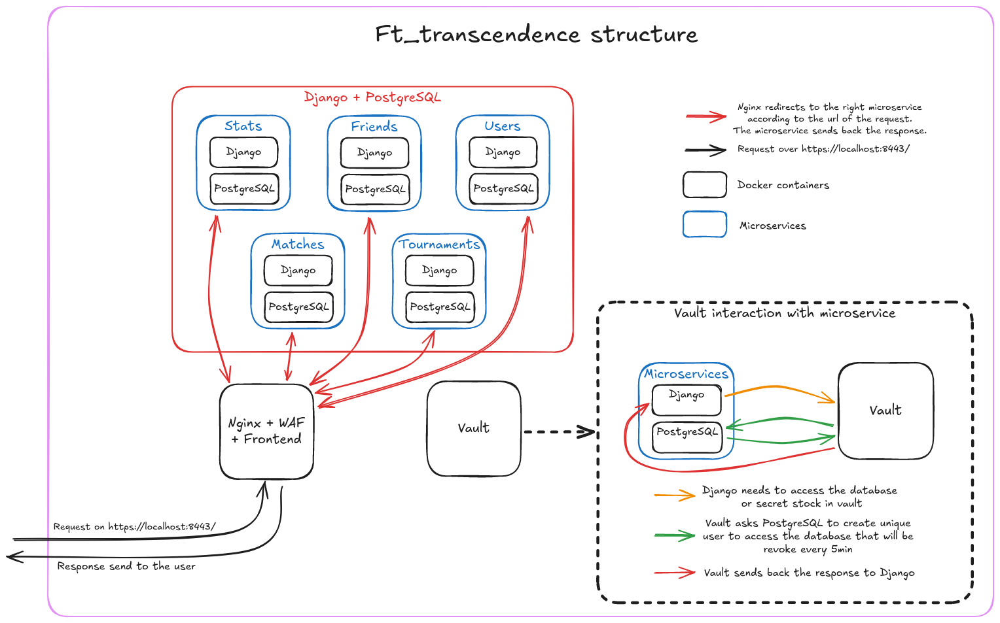

<h1 align=center>💻 Ft_transcendence</h1>
<p align="center">
  
</p>
<p align="center">
	
	
	
	
	
	
	
	
	
		
</p>
<p align="center">
  
</p>
## About
>This project is about doing something you’ve never done before.
>Remind yourself of the beginning of your journey in computer science.
>Look at you now. Time to shine!

[Subject Ft_transcendence Project 42](en.subject.pdf)

The goal of this project is to develop a website for playing Pong in matches and tournaments.

## Features
- **Description**: A dynamic website that manages users and offers two games: Pong and Flappy Bird.
- **Feature**: 
	- Single Page Application (SPA) architecture.
	- **Backend**: Built with Django.
	- **Frontend**: Utilizes Bootstrap, CSS, HTML, and JavaScript.
	- **Database**: Powered by PostgreSQL.
	- User management or authentication with API42 integration.
	- Games: Pong and Flappy Bird with tournament modes.
	- AI for Pong gameplay.
	- Web Application Firewall (WAF) and Vault for secret management.
	- Two-Factor Authentication (2FA) and JSON Web Tokens (JWT).
	- Backend designed as a microservice.
	- Compatibility with Chrome and Firefox browsers.
- **How to Use**: Run the command `docker compose up --build` to start the server. Then access the website at `https://localhost:8443/`.

## Setup

**Clone the Repository**:

```bash
git clone git@github.com:acardona123/42_ft_transcendence.git
cd 42_ft_transcendence
```

## Usage
1. Copy each `.env.sample` file to create corresponding `.env` files, and fill them with sensitive information.
2. Build and start the server:
	```bash
	docker compose up --build
	```
3. Access the website via `https://localhost:8443/`

## Website Features:

- Games:
	- Play Pong or Flappy Bird in the following modes:
		- Tournament.
		- 1 vs 1.
		- Against AI.
- User Account Management:
	- Register with a username and password.
	- Register using your 42 account.
	- Secure login with Google Two-Factor Authentication.
	- Update your profile information.
- Social Features:
	- View match history and statistics.
	- Add and manage friends.

## Code Structure


## Overview
### 1. Main menu


### 2. Pong game


### 3. Flappy bird duo game


### 4. Profile


### 5. Editing profile


### 6. Tournaments


### 7. Double factor authentification


